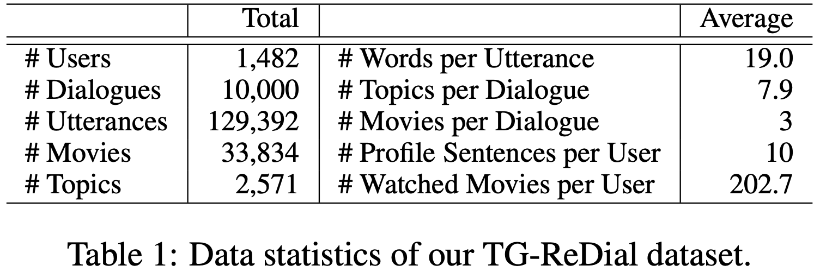
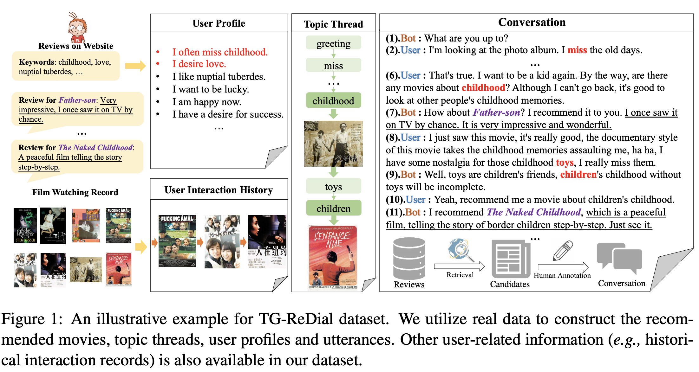
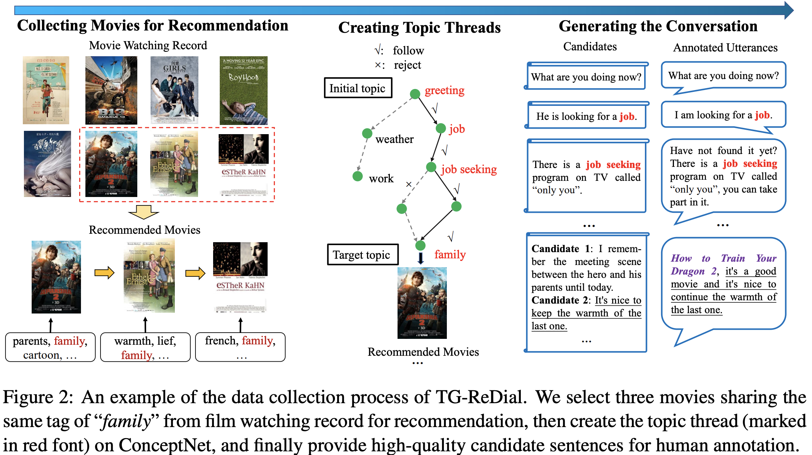

# TG-ReDial
We released a topic-guided conversational recommendation dataset for research on conversational/interactive recommender systems: TG-ReDial v1.0. It owns the following highlight:
#### 1st：Multi-turn Topic-guided Conversation Recommendation
Our dataset incorporates topic threads to enforce natural semantic transitions towards the recommendation scenario. Starting with a non-recommendation topic, the topic thread naturally guides the user to the recommendation scenario through a sequence of evolving topics through multi-turn interaction.
#### 2nd：Semi-automatic Annotated Dataset
We utilize ***real data*** to construct the recommended movies, topic threads, user profiles and utterances. And we propose semi-automatic approaches and novel rules to force human annotation into more reasonable and controllable.
#### 3rd：Detailed User Background Information
In our dataset, we incorporate each user with the user profile and interaction history, which are helpful to model the personality and preference of the user.

## Dataset Description
### Statistics


TG-ReDial consists of 129,392 utterances from 1,482 users. Our dataset is constructed in a topic-guided way, containing more informative sentences. On average, a dialogue has 7.9 topics and an utterance contains 19.0 words, which are larger than the corresponding numbers of existing CRS datasets. Furthermore, a user has 10 profile sentences and 202.7 watching records on average. 

### Example



A major feature of our dataset is that we organize the conversation by topic threads, so that the transitions from chit-chat to recommendation are more natural. Such a dataset is particularly useful to help integrate the recommender component into general-purpose chat-bots, since it is easy to align our topics with open-domain conversations. Moreover, we associate a conversation with a unique user identity, so that it can closely resemble real-world cases. Especially, we can obtain profiles and watching history for the users in a conversation. 

### Data Collection



To our knowledge, most of existing datasets mainly focus on cold-start scenario for CRS, while it is also important that CRS can leverage historical interaction data for existing users. Our dataset provides the possibility of training conversational recommendation algorithms with historical interaction data. It is also feasible to study other personalized tasks, since a user is involved in multiple conversations in our dataset. Note that, in order to protect user privacy, we only sample users with a large number of watching records. For derived user data (e.g., profile or watching records), we perform the anonymized operation and add randomized modification (e.g., removal, replacement or deletion). We also require that the retrieved review sentences have to be written via paraphrasing. Finally, we ask human annotators to manually trace the user identities with corresponding user data in our dataset. We do not include the data from the users that can be identified in the final dataset.

## Download
You can get this dataset from [GoogleDrive](https://drive.google.com/drive/folders/1jLkNtUgzqBITQJsbOjSq20S2zzpY5Foj?usp=sharing) or [BaiduNetDisk](https://pan.baidu.com/s/1fthFPz8Qjt54m4NR2G9AIA), the password for baidunetdisk is cc2o. ***We have added the interaction history of users into the netdisk recently, you`d better redownload it now.***

The dataset consists of four files:
#### train_data.pkl, valid_data.pkl, test_data.pkl: 
the split train/valid/test data by the ratio of 8:1:1;
#### User2TopicSent.pkl: 
the background information of each user, consisting of user id, interaction sequence and user profile.

## Baselines
To help use this dataset for conversational recommendation task, we provide the code of the baseline models in our paper "Towards Topic-Guided Conversational Recommender System", you can turn to the following link for acquiring details. (Under arrangement)

## Reference
If you use our dataset, please kindly cite our papers.
[Towards Topic-Guided Conversational Recommender System](https://arxiv.org/abs/2010.04125)
```c
@inproceedings{zhou2020topicguided,
  title={Towards Topic-Guided Conversational Recommender System}, 
  author={Kun Zhou and Yuanhang Zhou and Wayne Xin Zhao and Xiaoke Wang and Ji-Rong Wen},
  booktitle = {Proceedings of the 28th International Conference on Computational
               Linguistics, {COLING} 2020, Barcelona, Spain, December 8-11,
               2020},
  year      = {2020}
}
```
